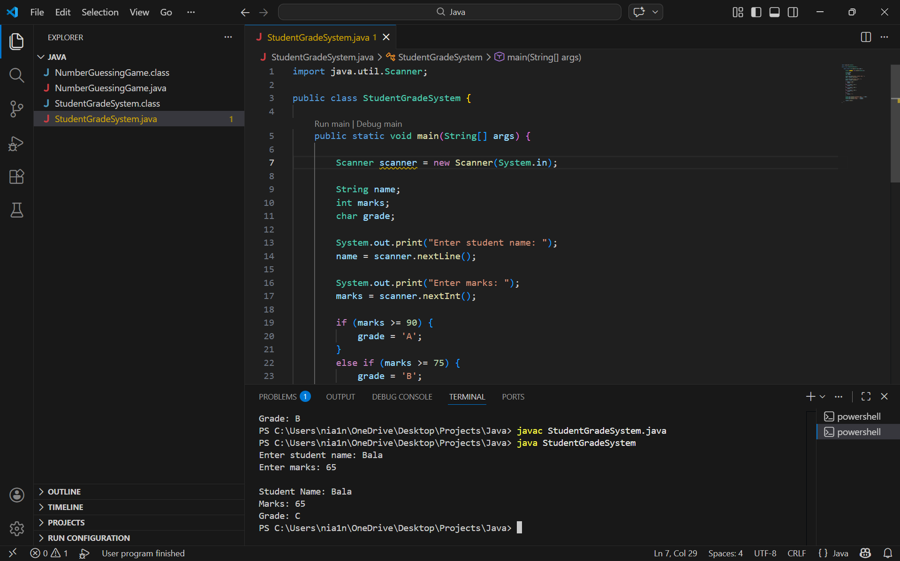

# Student Grade System (Java)

A simple Java console application that calculates and displays a student's grade based on their marks.

## Features

* Accepts student name as input
* Accepts student marks
* Calculates grade using conditional statements
* Displays student details and grade

## Grade Criteria

| Marks Range  | Grade |
| ------------ | ----- |
| 90 and above | A     |
| 75 – 89      | B     |
| 60 – 74      | C     |
| 50 – 59      | D     |
| Below 50     | F     |

## Technologies Used

* Java
* Console-based input/output

## How to Run

Compile the program:

javac StudentGradeSystem.java

Run the program:

java StudentGradeSystem

## Example Output

Enter student name: Surya
Enter marks: 82

Student Name: Surya
Marks: 82
Grade: B

## Author

Surya

